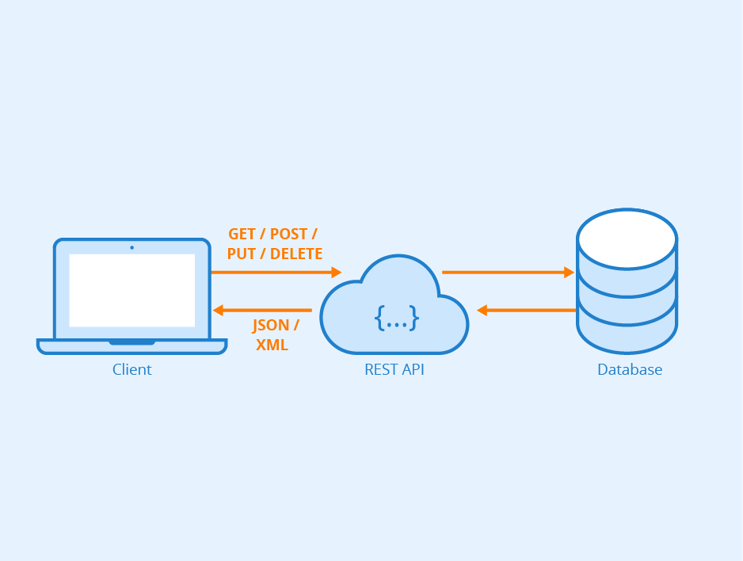

# DevFood - A Robust REST API for Food and Goods Delivery



## About The Project

The DeliveryExpressAPI is a robust REST API that powers an innovative delivery platform, connecting restaurants and
service providers to a vast customer base eager for their offerings. This API offers a comprehensive solution for food
and goods logistics, enabling business partners to efficiently manage orders, deliveries, and payments.

With features such as real-time order management, route optimization, and payment integration, this API provides an
exceptional delivery experience. It combines operational excellence with the customer desire for convenience and
variety, making it the ideal choice for the food and goods delivery industry.

### Table of Contents

- [Getting start](#getting-started)
- [Prerequisites](#prerequisites)
- [Installation](#installation)
- [Usage](#usage)
- [Contact](#contact)


<!-- GETTING STARTED -->

## Getting Started

### Prerequisites

Before you begin, ensure you have met the following requirements:

* **Java Development** Kit (JDK) 11 or higher
* **Apache Maven** (for building the project)
* **PostgreSQL database** (or modify application.properties and pom to use a different database)

### Installation

1. Clone the repository:
   ```sh
   git clone https://github.com/Thiagodd/devfood-api
   ```
2. Navigate to the project directory:
   ```sh
   cd your-repo
   ```
3. Open the application.yml file in the src/main/resources directory
   ```sh
   src/main/resources/application.yml
   ```
4. Modify the database credentials to match your setup:
   ```yaml
    datasource:
     url: jdbc:postgresql://localhost/your-database-name
     username: your-database-username
     password: your-database-password
   ```
   Replace your-database-url, your-database-name, your-database-username, and your-database-password with your actual
   database information.

5. Save the application.yml file.

6. Build the project using Maven:
   ```sh
   mvn clean install
   ```

7. Run the application:
   ```sh
   java -jar target/devfood-0.0.1-SNAPSHOT.jar
   ```

<!-- USAGE EXAMPLES -->

## Usage

This is an example of how to access the restaurant endpoint. For more details, see
the [Documentation](https://github.com/Thiagodd/devfood-apim).

- [X] Search Restaurants

- [X] Search Restaurant by Id

- [X] Register Restaurant

- [X] Updates a Restaurant’s data

| HTTP method | Endpoint          | Description                                    |
|-------------|-------------------|------------------------------------------------|
| GET         | 	/restaurants     | Returns all registered restaurants             |
| GET         | 	/restaurants/:id | Returns the restaurant by id                   |
| POST        | 	/restaurants     | Register a new restaurant                      |
| PUT         | 	/restaurants/:id | Updates information for an existing restaurant |
| DELETE      | 	/restaurants/:id | Exclude the restaurant by id                   |

_For more examples, please refer to the [Documentation](https://github.com/Thiagodd/devfood-api)_


<!-- CONTACT -->

## Contact

Thiago Silva - [Linkedin](https://www.linkedin.com/in/silvaathiagod/) - thiagodd.dev@gmail.com

Project Link: [https://github.com/Thiagodd/devfood-api](https://github.com/Thiagodd/devfood-api)
